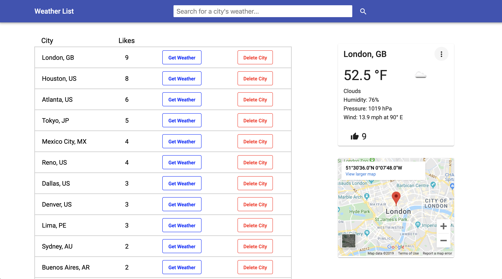

# Weather List

Weather List is a weather search website. The user can search for weather by city name, then they can like the city or add it to the list if it's not already there.

This is a full stack project made with Angular, Firebase, Express and Node. It demonstrates full CRUD capabilities (Create, Read, Update, Delete). It uses the RxJS library for asynchronous programming and observables. The design is mobile responsive to fit different screen sizes.

I have removed the API keys from the environment files (keys for Firebase, Google Maps, and OpenWeatherMap). Otherwise this repo works if you plug in your own API keys.

You can view the Weather List website at [https://weatherlist.herokuapp.com](https://weatherlist.herokuapp.com)

